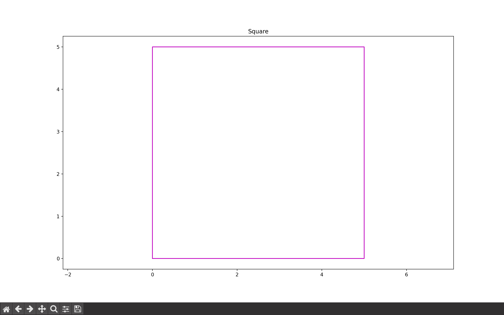

# shapeAndSize Library

The ShapeAndSize library is a Python library built using matplotlib that allows users to plot various geometric shapes like squares, rectangles, triangles, and more based on user input. It also provides functionalities to calculate the area, perimeter, diagonal, and other properties of these shapes.

## Features

- **Square**: Plot and compute area, perimeter, and diagonal of a square.
- **Rectangle**: Plot and compute area, perimeter, and diagonal of a rectangle.
- **Triangle**: Plot and compute area, perimeter, and height of a triangle.
- **Equilateral Triangle**: Plot and compute area, perimeter, and height of an equilateral triangle.
- **Parallelogram**: Plot and compute area and perimeter of a parallelogram.
- **Rhombus**: Plot and compute area, perimeter, and side of a rhombus.
- **Trapezoid**: Plot and compute area, perimeter, and side of a trapezoid.
- **Kite**: Plot and compute area, perimeter, and sides of a kite.
- **Regular Polygon**: Plot and compute properties of polygons with any number of sides.
- **Semi-Circle**: Plot and compute area, circumference, and diameter of a semi-circle.
- **Circle**: Plot and compute area, circumference, and diameter of a circle.
- **Star**: Plot a star shape.


## Usage

Here's an example of how to use the ShapeAndSize library to plot a square:

```python
from shapeAndSize import *
#for all the shapes
```

# Plot a square with side length 5
```python
from shapeAndSize import square
square.plot(5)
```


### Output




# Plot a Triangle with sides 3,4,5
```python
from shapeAndSize import traingle
triangle.plot(3,4,5)
```


### Output


# Rectangle with sides (20,30) ,marker-'*',LineStyle-'dotted' and color-'blue' 
```python
from shapeAndSize import *
rectangle.plot(20,30,'*','dotted','blue')
```


### Output


## Documentation

### Square

#### Methods

- **plot(side, marker='none', linestyle='solid', color='m')**: Plot a square with the specified side length, marker, linestyle, and color.
- **area(side)**: Calculate the area of the square.
- **perimeter(side)**: Calculate the perimeter of the square.
- **diagonal(side)**: Calculate the diagonal of the square.

### Rectangle, Triangle, Equilateral Triangle, Parallelogram, Rhombus, Trapezoid, Kite, Regular Polygon, Semi-Circle, Circle, Star

Similar methods are available for each shape to plot and calculate their properties.

## Contributing

We welcome contributions! If you have any ideas for improvements or new features, please submit a pull request or open an issue on GitHub.

## License

This project is not yet licensed. I hadn't considered that yet.
